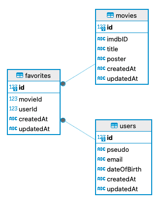

# BBM

Node@22

## FRONT

Angular@17

### Constest

Info sur la concours de la semaine

```
/contest
```

### List

Liste des films

```
/list
```

Recherche par titre = 'nom'

```
/list?s=nom
```

### Details

Details d'un film

```
/details/:id
```

## BACK

NestJS@10
API : [OMDb API](https://www.omdbapi.com/)


### Users

Gestion des users

```
/user
```

### Movies

Permet d'éviter de request l'API OMDbAPI
Gestion des movies

```
/movie
```

Gestion des movies sur OMDbAPI pour récupérer toutes les informations

```
/user/omdb
```

### Favorites

Gestion des concours

```
/favorite
```

Gestion du concours de la semaine

```
/favorite/current-week
```

Le résultat du concours de la semaine en cours

```
/favorite/result/current-week
```
